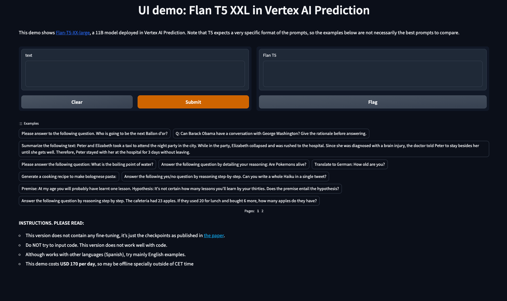

#  Deploy Flan-T5 XXL on Vertex AI Prediction

This code shows how to **deploy a FLAN-T5 XXL model** (11B parameters) in Vertex AI Prediction. The model will be downloaded and embedded in a custom prediction image, using an [Uvicorn](https://www.uvicorn.org/) server. You will use a `a2-highgpu-1g` machine type in **Vertex AI Prediction containing 1xA100 GPU**.

Building the image and deploy into Vertex AI is a process that **can take up to 4 hours**, and the cost of a Vertex Prediction endpoint (24x7) is **around USD 170 per day** with 1xA100 GPU.

A demo based on [Gradio](https://gradio.app/) and deployed in [Cloud Run](https://cloud.google.com/run) is also provided to easily make requests into the deployed image.


## The model: Flan-T5 XXL (fp16)

If you are familiar with T5, an open-source LLM model from Google, Flan-T5 improves T5 at almost everything. For the same number of parameters, Flan-T5 models have been fine-tuned on more than 1000 additional tasks covering **also more languages**. 

As mentioned in the [paper](https://arxiv.org/abs/2210.11416.pdf): 

>  We find that instruction finetuning with the above aspects dramatically improves
performance on a variety of model classes (PaLM, T5, U-PaLM), prompting setups (zero-shot, few-shot, CoT),
and evaluation benchmarks (MMLU, BBH, TyDiQA, MGSM, open-ended generation, RealToxicityPrompts). [...]
Flan-PaLM achieves state-of-the-art performance on several benchmarks, such as 75.2% on five-shot MMLU.


Flan-T5 XXL is released with [different sizes](https://github.com/google-research/t5x/blob/main/docs/models.md#flan-t5-checkpoints): Small, Base, Large, XL and XXL. XXL is the biggest version of Flan-T5, containing 11B parameters.

Model card can be accessed [here](https://huggingface.co/google/flan-t5-xxl).

You will use the **fp16 version** (floating point 16) of the model, which reduces the original size (42 GiB) by half (21 GiB). This reduced version of the model is easier to manage and can be downloaded from [Hugging Face](https://huggingface.co/philschmid/flan-t5-xxl-sharded-fp16/tree/main). Original checkpoints from Google for all sizes are available [here](https://github.com/google-research/t5x/blob/main/docs/models.md). 

You must [download the model]((https://huggingface.co/philschmid/flan-t5-xxl-sharded-fp16/tree/main)) and store it in `predict/flan-t5-xxl-sharded-fp16` directory, with a similar content like this. Note no need to use a `handler.py` since you will not use TorchServe:
```sh
config.json
pytorch_model-00001-of-00012.bin
pytorch_model-00002-of-00012.bin
pytorch_model-00003-of-00012.bin
pytorch_model-00004-of-00012.bin
pytorch_model-00005-of-00012.bin
pytorch_model-00006-of-00012.bin
pytorch_model-00007-of-00012.bin
pytorch_model-00008-of-00012.bin
pytorch_model-00009-of-00012.bin
pytorch_model-00010-of-00012.bin
pytorch_model-00011-of-00012.bin
pytorch_model-00012-of-00012.bin
pytorch_model.bin.index.json
special_tokens_map.json
spiece.model
tokenizer.json
tokenizer_config.json
```


## Build Custom Prediction Container image 

A Custom Container image for predictions is required. A Custom Container image in Vertex AI [requires that the container must run an HTTP server](https://cloud.google.com/ai-platform-unified/docs/predictions/custom-container-requirements#image). Specifically, the container must listen and respond to liveness checks, health checks, and prediction requests. 

You will use a [Uvicorn](https://www.uvicorn.org/) server. You must build and push the container image to [Artifact Registry](https://cloud.google.com/artifact-registry):
```sh
gcloud auth configure-docker europe-west4-docker.pkg.dev
gcloud builds submit --tag europe-west4-docker.pkg.dev/argolis-rafaelsanchez-ml-dev/ml-pipelines-repo/flan-t5-xxl-sharded-fp16 --machine-type=e2-highcpu-8 --timeout="2h" --disk-size=300
```

This build process can take **up to 2 hours** even with a `e2-highcpu-8` due to the container size (around 20 GiB).


## Deploy the model to Vertex AI Prediction

Upload and deploy the image to Vertex AI Prediction using the provided script: `python3 upload_custom.py`. You will use a `a2-highcpu-1g` (12 vCPU, 85 GB RAM) with 1xA100 (40 GB HBM2) to deploy. Note the [price of $4.22 per node-hour](https://cloud.google.com/vertex-ai/pricing#custom-trained_models) plus the [price of $2.9 per hour for the GPU](https://cloud.google.com/compute/gpus-pricing). 

The upload and deploy process **may take up to 2 hours**. Note the parameter `deploy_request_timeout` to avoid a `504 Deadline Exceeded` error during the deployment:
```python
from google.cloud import aiplatform

STAGING_BUCKET = 'gs://argolis-vertex-europewest4'
PROJECT_ID = 'argolis-rafaelsanchez-ml-dev'
LOCATION = 'europe-west4'

aiplatform.init(project=PROJECT_ID, staging_bucket=STAGING_BUCKET, location=LOCATION)

DEPLOY_IMAGE = 'europe-west4-docker.pkg.dev/argolis-rafaelsanchez-ml-dev/ml-pipelines-repo/flan-t5-xxl-uvicorn' 
HEALTH_ROUTE = "/health"
PREDICT_ROUTE = "/predict"
SERVING_CONTAINER_PORTS = [7080]

model = aiplatform.Model.upload(
    display_name=f'custom-finetuning-flan-t5-xxl',    
    description=f'Finetuned Flan T5 XXL model with Uvicorn and FastAPI',
    serving_container_image_uri=DEPLOY_IMAGE,
    serving_container_predict_route=PREDICT_ROUTE,
    serving_container_health_route=HEALTH_ROUTE,
    serving_container_ports=SERVING_CONTAINER_PORTS,
)
print(model.resource_name)

# Retrieve a Model on Vertex
model = aiplatform.Model(model.resource_name)

# Deploy model
endpoint = model.deploy(
     machine_type='a2-highgpu-1g',
     traffic_split={"0": 100}, 
     min_replica_count=1,
     max_replica_count=1,
     accelerator_type= "NVIDIA_TESLA_A100",    
     accelerator_count=1,
     traffic_percentage=100,
     deploy_request_timeout=1200,
     sync=True,
)
endpoint.wait()
```


## Gradio demo UI

You are now ready to predict on the deployed model. You can use the REST API or the python SDK, but in this case you will build a simple demo UI using [Gradio](https://gradio.app/).

The Gradio app is built on [Cloud Run](https://cloud.google.com/run). You need to build the docker first, upload it to Artifact registry and then deploy it in Cloud Run. The following command runs the last step (Cloud Run deployment):
```sh
gcloud run deploy flan-t5-xxl-gradio --port 7860 --image europe-west4-docker.pkg.dev/argolis-rafaelsanchez-ml-dev/ml-pipelines-repo/flan-t5-xxl-gradio --allow-unauthenticated --region=europe-west4 --platform=managed  
```

The Gradio app deployed in Cloud Run. You can test the provided examples ot try yours. Make sure you read the instructions provided in the UI main page:

Check the [live demo](https://flan-t5-xxl-gradio-m3klxwrsfa-ez.a.run.app/).




## References

`[1]` Google blog: [The Flan Collection: Advancing open source methods for instruction tuning](https://ai.googleblog.com/2023/02/the-flan-collection-advancing-open.html)      
`[2]` Research paper: [FLAN-T5](https://arxiv.org/abs/2210.11416.pdf)     
`[3]` Original [FLAN-T5 Checkpoints](https://github.com/google-research/t5x/blob/main/docs/models.md#flan-t5-checkpoints) from Google     
`[4]` Medium post: [Serving Machine Learning models with Google Vertex AI](https://medium.com/google-cloud/serving-machine-learning-models-with-google-vertex-ai-5d9644ededa3)        
`[5]` Phil Schmid blog: [Deploy FLAN-T5 XXL on Amazon SageMaker](https://www.philschmid.de/deploy-flan-t5-sagemaker)     
`[6]` Reduced fp16 [Flan-T5 XXL](https://huggingface.co/philschmid/flan-t5-xxl-sharded-fp16) model.     


